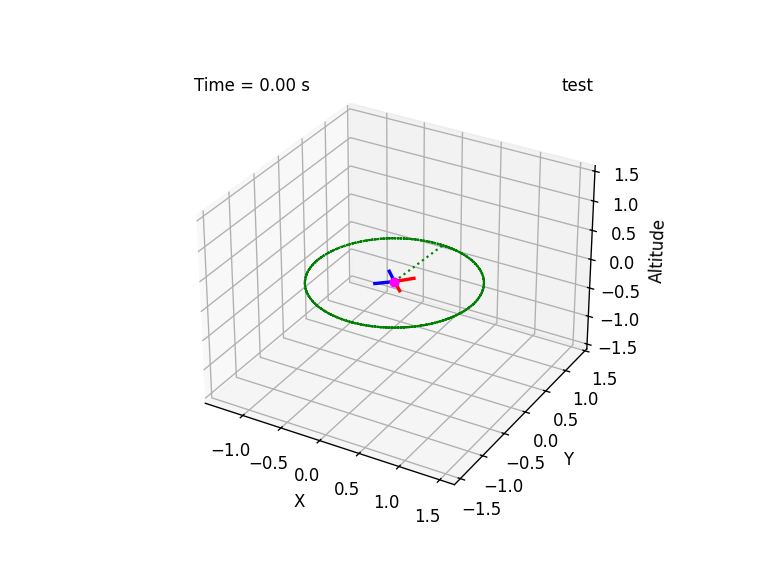
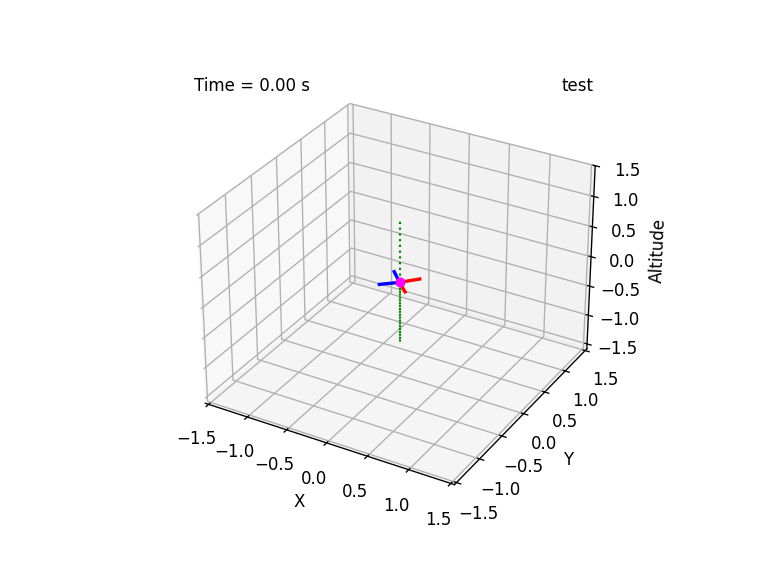

## Summary 

This is taken directly from ["Neural-Swarm: Decentralized Close-Proximity Multirotor Control Using Learned Interactions"](https://ieeexplore.ieee.org/stamp/stamp.jsp?arnumber=9196800)





### Single Multirotor Dynamics

A single multirotor’s state comprises the global position $\mathbf{p} \in \mathbb{R}^3$, global velocity $\mathbf{v} \in \mathbb{R}^3$, attitude rotation matrix $R \in SO(3)$, and body angular velocity $\boldsymbol{\omega} \in \mathbb{R}^3$. We consider the following dynamics:

$$
\dot{\mathbf{p}} = \mathbf{v}, \quad m\dot{\mathbf{v}} = mg + R \mathbf{f}_u + \mathbf{f}_a,
$$

$$
\dot{R} = RS(\boldsymbol{\omega}), \quad J \dot{\boldsymbol{\omega}} = J \boldsymbol{\omega} \times \boldsymbol{\omega} + \boldsymbol{\tau}_u + \boldsymbol{\tau}_a,
$$

where $m$ and $J$ are the mass and inertia matrix of the system, respectively; $S(\cdot)$ is a skew-symmetric mapping; $\mathbf{g} = [0, 0, -g]^\top$ is the gravity vector; and $\mathbf{f}_u = [0, 0, T]^\top$ and $\boldsymbol{\tau}_u = [\tau_x, \tau_y, \tau_z]^\top$ are the total thrust and body torques from the rotors, respectively. The output wrench $\boldsymbol{\eta} = [T, \tau_x, \tau_y, \tau_z]^\top$ is linearly related to the control input $\boldsymbol{\eta} = B_0 \mathbf{u}$, where $\mathbf{u} = [n_1^2, n_2^2, \dots, n_k^2]^\top$ is the squared motor speeds for a vehicle with $k$ rotors and $B_0$ is the actuation matrix. 

### Reference Trajectory Tracking

Similar to [7], we employ an integral controller that accounts for the predicted residual dynamics, which in our case are the multi-vehicle interaction effects. For vehicle $i$, we define the position tracking error as $\tilde{\mathbf{p}}^{(i)} = \mathbf{p}^{(i)} - \mathbf{p}_d^{(i)}$ and the composite variable $\mathbf{s}^{(i)}$ as:

$$
\mathbf{s}^{(i)} = \dot{\mathbf{p}}^{(i)} + 2\Lambda \tilde{\mathbf{p}}^{(i)} + \Lambda^2 \int \tilde{\mathbf{p}}^{(i)} dt = \dot{\mathbf{p}}^{(i)} - \mathbf{v}_r^{(i)}, \tag{8}
$$

where $\mathbf{v}_r^{(i)} = \dot{\mathbf{p}}_d^{(i)} - 2\Lambda \tilde{\mathbf{p}}^{(i)} - \Lambda^2 \int \tilde{\mathbf{p}}^{(i)} dt$ is the reference velocity. We design the total desired rotor force $\mathbf{f}_d^{(i)}$ as:

$$
\mathbf{f}_d^{(i)} = m \dot{\mathbf{v}}_r^{(i)} - K\mathbf{s}^{(i)} - mg - \hat{\mathbf{f}}_a^{(i)},
$$

```math
\hat{\mathbf{f}}_a^{(i)} = \rho\left( \sum_{\mathbf{x}^{(ij)} \in \mathcal{N}(i)} \phi(\mathbf{x}^{(ij)}, \boldsymbol{\theta}_\phi, \boldsymbol{\theta}_\rho) \right).
```

Note that the position control law in (9) is decentralized, because we only consider the relative states $\mathbf{x}^{(ij)} \in \mathcal{N}(i)$ in the controller.

Using $\mathbf{f}_d^{(i)}$, the desired total thrust $T_d^{(i)}$ and desired attitude $R_d^{(i)}$ can be easily computed [23]. Given $R_d^{(i)}$, we can use any attitude controller to compute $\boldsymbol{\tau}_d^{(i)}$, for example robust nonlinear tracking control with global exponential stability [23], or geometric tracking control on $SE(3)$ [24]. From this process, we get $\boldsymbol{\eta}_d^{(i)} = [T_d^{(i)}; \boldsymbol{\tau}_d^{(i)}]$, and then the desired control signal of each vehicle is $\mathbf{u}_d^{(i)} = B_0^\dagger \boldsymbol{\eta}_d^{(i)}$, which can be computed in a decentralized manner for each vehicle.
